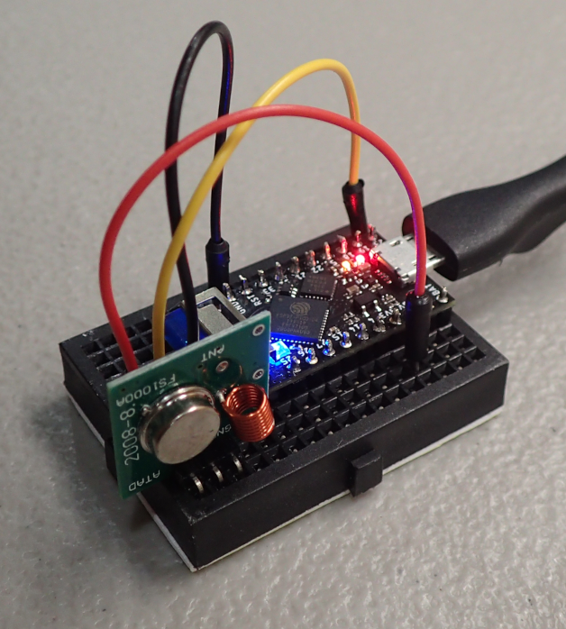

# MicroPython controlled 433MHz Power Relay using Hourly Electricity Pricing
At my home, I have signed up for hourly electricity rates with the Ameren Illinois [Power Smart Pricing](https://www.ameren.com/illinois/account/customer-service/bill/power-smart-pricing) program. 

Ever since signing up, I have wanted to create a device that would utilize the [hourly pricing data](https://www.ameren.com/account/retail-energy) to automatically turn off a device when rates are high and turn it on again when rates are low. I have finally put together hardware and scripts for charging the batteries in my [Chevrolet Volt](https://en.wikipedia.org/wiki/Chevrolet_Volt).

